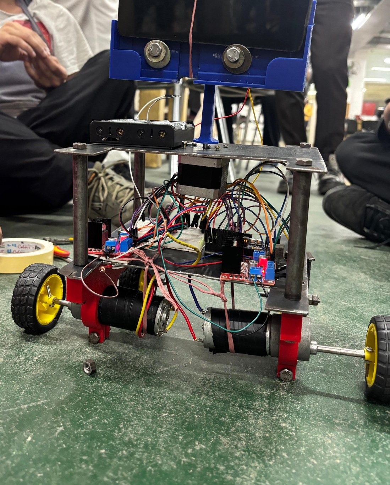
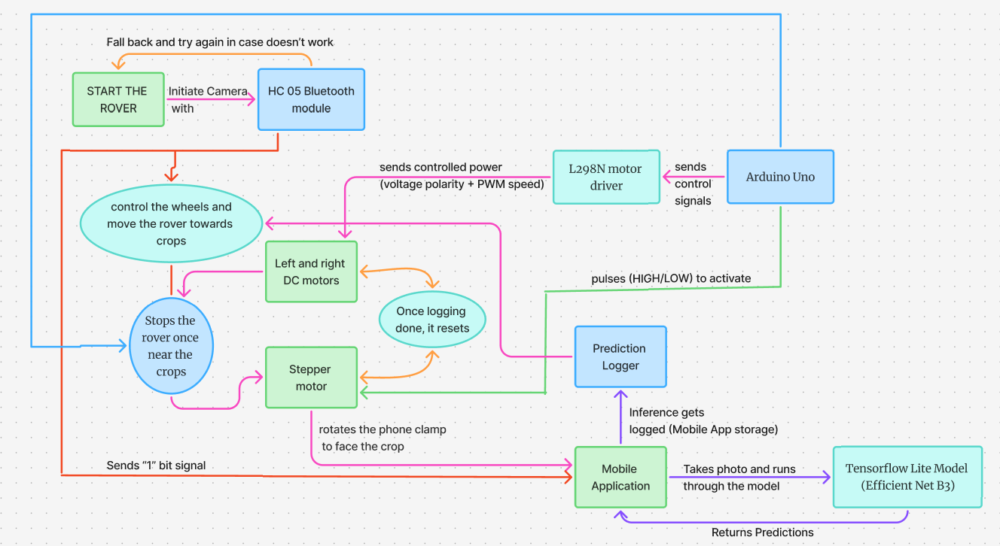
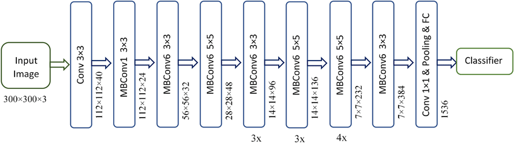
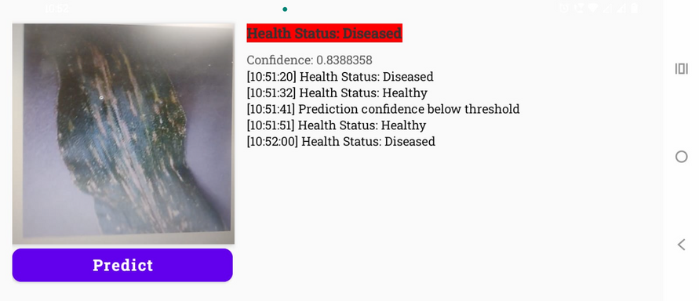
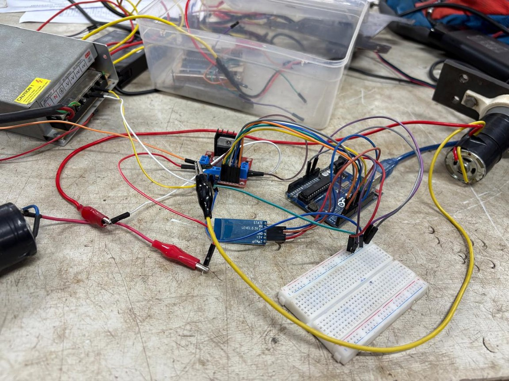
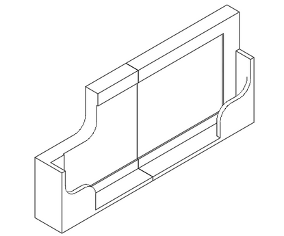
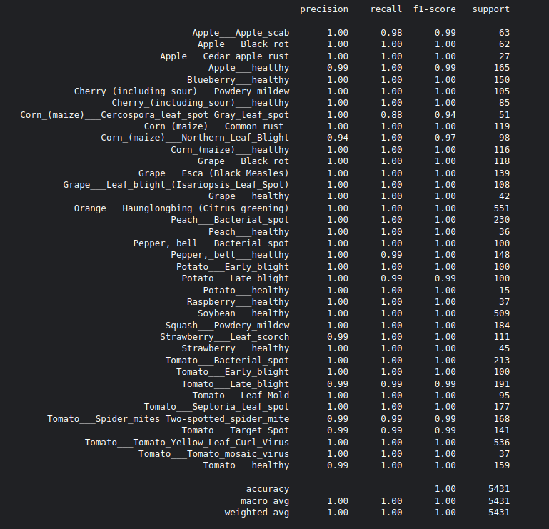

# 🌿 LeafLens — Autonomous Plant Disease Classifier

> **Spot it, Save it.**
> An autonomous ground rover that drives through crop fields, photographs leaves with a smartphone camera, and detects plant diseases in real time using an on-device deep-learning model.

<p align="center">
  
</p>

---

## Table of Contents

- [Overview](#overview)
- [The Problem](#the-problem)
- [Motivation](#motivation)
- [How It Works](#how-it-works)
- [System Architecture](#system-architecture)
- [The Machine-Learning Model](#the-machine-learning-model)
- [The Mobile Application](#the-mobile-application)
- [The Rover (Hardware & Firmware)](#the-rover-hardware--firmware)
- [Supported Crops & Diseases](#supported-crops--diseases)
- [Repository Structure](#repository-structure)
- [Getting Started](#getting-started)
- [Results](#results)
- [Cost Estimation](#cost-estimation)
- [Future Work](#future-work)

---

## Overview

LeafLens is an end-to-end agricultural diagnostics system built around three cooperating parts:

1. **A four-wheeled autonomous rover** that navigates a crop field, stopping in front of plants.
2. **An Android application** running an embedded TensorFlow Lite model that captures a leaf image and classifies its health in real time.
3. **A microcontroller layer** (Arduino UNO + HC-05 Bluetooth) that coordinates motion and triggers the phone's camera at each plant.

The rover stops near a plant, signals the phone over Bluetooth, the phone snaps a photo, runs it through an **EfficientNet-B3** classifier, and logs the verdict — *Healthy* or *Diseased* — with a confidence score and timestamp. The goal is to replace slow, subjective manual crop inspection with fast, repeatable, automated screening.

---

## The Problem

- Crop losses in India due to weeds, pests, and diseases range from **10–35% annually** (Parliament report).
- Combined yield losses from pests, diseases, and rodents are about **15–25%**, costing **₹0.9–1.4 lakh crore per year**.
- These losses directly undermine Sustainable Development Goals such as *Zero Hunger*, *No Poverty*, *Decent Work & Economic Growth*, *Responsible Production*, *Climate Action*, and *Life on Land*.

Early detection is the single biggest lever for reducing these losses — but it is exactly where current practice falls short.

---

## Motivation

Traditional plant-disease detection relies on **visual inspection** by farmers or agricultural experts. This approach is:

- **Time-consuming** and impractical at the scale of large farms,
- **Subjective**, depending on the inspector's experience, and
- **Reactive** — diseases are often caught late, after they have spread.

The common fallbacks are equally costly: farmers either fail to identify diseases early, or over-apply pesticides, harming both the crop and the environment.

A **smartphone camera** changes the economics of the problem. It is an affordable, ubiquitous platform that bundles a capable camera with a processor strong enough to run a modern computer-vision model on-device — no cloud, no connectivity required. Mounting that phone on an autonomous rover scales inspection across an entire field with minimal human effort, and the captured data can later power disease reports, treatment suggestions, and preventive tips.

---

## How It Works

```
            ┌──────────────────────────────────────────────────────────┐
            │                      ON THE ROVER                         │
            │                                                            │
   Arduino UNO ──control signals──> L298N driver ──PWM──> 2× DC motors   │
        │                                                  (drive wheels)│
        │──pulses──> Stepper motor (rotates the phone mount to the crop) │
        │                                                                │
        └── over HC-05 Bluetooth ── sends "1;" ──┐                       │
            └────────────────────────────────────│───────────────────── ┘
                                                  ▼
            ┌──────────────────────────────────────────────────────────┐
            │                  ON THE SMARTPHONE (Android)              │
            │                                                            │
            │  "1;" received  ──> capture photo ──> resize to 224×224    │
            │       ──> EfficientNet-B3 (TFLite) ──> class + confidence  │
            │       ──> map class → Healthy / Diseased                   │
            │       ──> append to on-screen, timestamped log             │
            └──────────────────────────────────────────────────────────┘
```

A typical cycle:

1. The rover drives forward for a fixed interval (`moveForward`) and stops near a plant.
2. The Arduino rotates the **stepper motor** to point the phone's camera at the crop.
3. The Arduino transmits the byte string `"1;"` to the phone over the **HC-05** Bluetooth module.
4. The Android app receives the signal, **captures a photo**, preprocesses it, and runs **inference**.
5. The predicted class is mapped to a **Healthy/Diseased** status and written to an on-screen log with a timestamp and confidence.
6. The stepper resets, and the rover moves on to the next plant.

---

## System Architecture

The full control and data flow across the rover, microcontroller, and phone:

<p align="center">
  
</p>

| Layer | Component | Responsibility |
|-------|-----------|----------------|
| **Compute / ML** | Android phone + TFLite EfficientNet-B3 | Capture image, run inference, log result |
| **Communication** | HC-05 Bluetooth (SPP, UUID `00001101-…`) | Phone ⇄ Arduino link; trigger signal `"1;"` |
| **Control** | Arduino UNO | Sequencing of motion and camera trigger |
| **Actuation** | L298N driver → 2× Johnson DC motors | Drive wheels |
| **Actuation** | NEMA-17 stepper motor | Orient the phone mount toward the crop |
| **Mechanical** | Steel chassis, 3D-printed mounts/clamps, caster support | Structure and stability |

---

## The Machine-Learning Model

### Theory — why EfficientNet-B3?

The classifier is built on **EfficientNet-B3**, a convolutional neural network from the EfficientNet family. EfficientNet's central idea is **compound scaling**: instead of arbitrarily increasing a network's depth, width, or input resolution in isolation, all three dimensions are scaled together by a fixed set of coefficients. This yields models that are far more parameter- and FLOP-efficient than older architectures at the same accuracy — exactly the property needed for **on-device, real-time inference on a phone**.

The backbone is composed mainly of **MBConv (Mobile Inverted Bottleneck Convolution)** blocks with squeeze-and-excitation, the same lightweight building blocks popularised by MobileNet, which keep the model small while preserving representational power.

<p align="center">
  
</p>

The project uses **transfer learning**: the EfficientNet-B3 backbone is initialised with ImageNet weights, then a custom classification head is trained on the PlantVillage disease dataset.

### Architecture

The trained network (see [`model/model_structure.png`](model/model_structure.png)):

| Layer | Output Shape | Params |
|-------|-------------|--------|
| `efficientnetb3` (functional backbone) | `(None, 1536)` | 10,783,535 |
| `batch_normalization` | `(None, 1536)` | 6,144 |
| `dense` (ReLU) | `(None, 256)` | 393,472 |
| `dropout` | `(None, 256)` | 0 |
| `dense_1` (softmax) | `(None, 38)` | 9,766 |

**Total params:** 11,192,917 · **Trainable:** 11,102,542 · **Non-trainable:** 90,375

- **Input:** RGB image resized to **224 × 224 × 3**.
- **Output:** softmax over **38 classes** (crop + condition pairs).
- The head adds batch-norm → a 256-unit dense layer → dropout (regularisation) → a 38-way softmax classifier.

### On-device deployment

The Keras model is exported to **TensorFlow Lite** (`model_pdcs.tflite`, bundled in the app under `app/src/main/ml/`) and run through Android's **ML Model Binding**. Inference is performed entirely on the phone — no network connection required in the field. The full-precision Keras weights are kept in [`model/`](model/) for reference and retraining.

---

## The Mobile Application

A native **Android (Kotlin + Jetpack Compose / View Binding)** app, locked to landscape orientation.

<p align="center">
  
</p>

Key responsibilities (`MainActivity.kt`):

- **CameraX** preview and photo capture (`LifecycleCameraController`, `ImageCapture`).
- **Bluetooth** pairing and connection to the HC-05 (paired as a device whose name contains `"PDC"`), running a background `ConnectThread` over an RFCOMM socket; incoming `"1;"` triggers a capture.
- **Preprocessing:** the captured image is decoded, down-sampled, and scaled to 224×224, then unpacked into a `FloatArray` of RGB channel values loaded into a `TensorBuffer`.
- **Inference:** `ModelPdcs` (the bound TFLite model) produces class probabilities; the arg-max class and its confidence are read off.
- **Decisioning:** the predicted class is looked up in [`classes.csv`](application_studio/app/src/main/assets/classes.csv). If the condition column reads `Healthy`, the status is shown **green**; otherwise **red** ("Diseased"). Below-threshold predictions are flagged.
- **Logging:** every prediction is appended to an auto-scrolling, **timestamped log** so an inspector can review a whole field run.

Permissions requested: `CAMERA`, `BLUETOOTH_SCAN`, `BLUETOOTH_CONNECT` (and legacy `WRITE_EXTERNAL_STORAGE` on API ≤ 28).

---

## The Rover (Hardware & Firmware)

<p align="center">
  
  &nbsp;&nbsp;
  
</p>

**Electronics**

- **Arduino UNO** — master controller.
- **HC-05 Bluetooth module** — serial link to the phone (9600 baud).
- **L298N motor driver** — drives the two DC motors with direction + PWM speed control.
- **2× Johnson 600 RPM 12 V geared DC motors** — high torque (~4.5 kg·cm) for the drive wheels.
- **NEMA-17 stepper motor** (4.2 kg·cm @ 1.2 A/phase) — precise, repeatable rotation of the camera/phone mount.

**Firmware** (`arduino/bluetooth_sketch/bluetooth_sketch.ino`)

The sketch uses `SoftwareSerial` for the HC-05 and the `Stepper` library for the mount. Its loop drives the rover forward, steps the stepper to aim the camera, transmits `"1;"` to trigger a photo, waits, then steps back. Helper routines (`moveForward`, `moveBackward`, `moveLeft`, `moveRight`) set the L298N direction pins and PWM enables.

**Mechanical**

A steel base/top chassis carries the electronics, with **3D-printed phone mount, motor clamps, and wheels**, plus a caster-wheel support for balance. Design choices that improved the build: reducing the drive motors from 4 → 2 for power efficiency, replacing a worm-gear system with the stepper motor, and 3D-printing clamps/mounts to keep the structure lightweight.

---

## Supported Crops & Diseases

The model covers **38 classes** across 14 crop types (PlantVillage taxonomy). Full mapping in [`model/classes.csv`](model/classes.csv):

| Crop | Conditions |
|------|------------|
| Apple | Apple scab · Black rot · Cedar apple rust · Healthy |
| Blueberry | Healthy |
| Cherry | Powdery mildew · Healthy |
| Corn | Cercospora gray leaf spot · Common rust · Northern leaf blight · Healthy |
| Grape | Black rot · Esca · Leaf blight · Healthy |
| Orange | Citrus greening |
| Peach | Bacterial spot · Healthy |
| Bell pepper | Bacterial spot · Healthy |
| Potato | Early blight · Late blight · Healthy |
| Raspberry | Healthy |
| Soybean | Healthy |
| Squash | Powdery mildew |
| Strawberry | Leaf scorch · Healthy |
| Tomato | Bacterial spot · Early blight · Late blight · Leaf mold · Septoria leaf spot · Spider mites · Target spot · Yellow leaf curl virus · Mosaic virus · Healthy |

---

## Repository Structure

```
plant_disease_classifier_v2/
├── application_studio/                # Android Studio project (Kotlin)
│   └── app/src/main/
│       ├── java/.../MainActivity.kt   # camera, Bluetooth, inference, logging
│       ├── java/.../util.kt           # permission helpers
│       ├── assets/classes.csv         # class index → crop / condition
│       └── ml/model_pdcs.tflite       # deployed TFLite model
├── arduino/
│   └── bluetooth_sketch/bluetooth_sketch.ino   # rover firmware
├── model/
│   ├── efficientnetb3-...-weights.h5  # trained Keras weights
│   ├── classes.csv / class_dict.csv   # class definitions
│   ├── model_structure.png            # model summary
│   └── classification_report.png      # evaluation metrics
├── Demonstration/                     # demo video + presentation
└── docs/assets/                       # images used in this README
```

---

## Getting Started

### 1. Android app

**Requirements:** Android Studio (Koala+), an Android device on **API 24+** with a camera and Bluetooth (a physical device is required — the camera and Bluetooth can't be emulated).

```bash
cd application_studio
./gradlew assembleDebug      # or open the folder in Android Studio and Run
```

The TFLite model is already bundled, so no extra ML setup is needed. On first launch, grant Camera and Bluetooth permissions.

### 2. Rover firmware

Open `arduino/bluetooth_sketch/bluetooth_sketch.ino` in the Arduino IDE, install the **Stepper** library if needed, select the **Arduino UNO** board, and upload. Wire the HC-05, L298N, DC motors, and NEMA-17 per the pin assignments at the top of the sketch.

### 3. Pairing

Power the rover, then pair the phone with the HC-05 module from Android Bluetooth settings. **The module's Bluetooth name must contain `PDC`** — the app filters paired devices on that substring before connecting.

### 4. Retraining (optional)

The Keras weights and class dictionary in [`model/`](model/) let you fine-tune on additional data; re-export to TFLite and drop the file into `app/src/main/ml/` to deploy.

---

## Results

The model was evaluated on a **5,431-image** test set (full per-class breakdown in [`model/classification_report.png`](model/classification_report.png)):

<p align="center">
  
</p>

- **Overall accuracy: ≈ 1.00** on the held-out test set.
- **Macro-average** and **weighted-average** precision, recall, and F1 all ≈ 1.00 across the 38 classes.

> Note: these figures reflect the curated PlantVillage-style dataset (uniform backgrounds). Real-world field performance depends on lighting, occlusion, and crop variety — see [Future Work](#future-work).

---

## Cost Estimation

| Item | Cost (₹) |
|------|----------|
| Material | 309 |
| Machine usage | 3,060 |
| Electronics | 2,460 |
| Labour | 35,000 |
| **Total** | **40,829** |

---

## Future Work

- Partner with government and agricultural organisations for scaling and sustainability.
- Make the app more feature-rich (treatment suggestions, preventive tips) and improve error handling.
- Link with **drones** for aerial imaging and **IoT sensors** for richer field analytics.
- Optimise rover cost and improve durability across uneven terrain.
- Harden the model for real-world, in-field imagery beyond the curated dataset.


<p align="center"><i>LeafLens — bringing affordable, automated crop-health screening to the field.</i></p>
